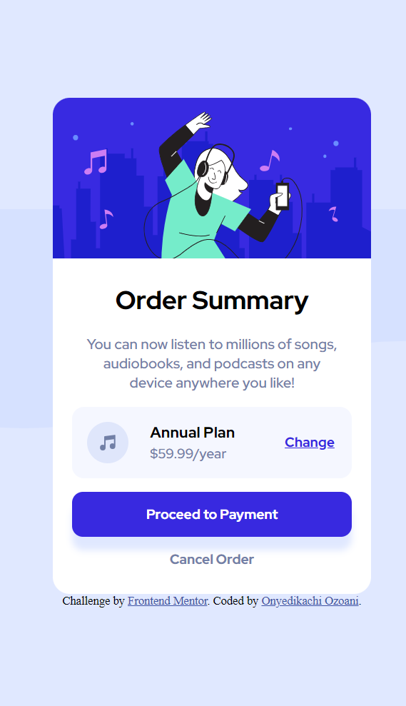
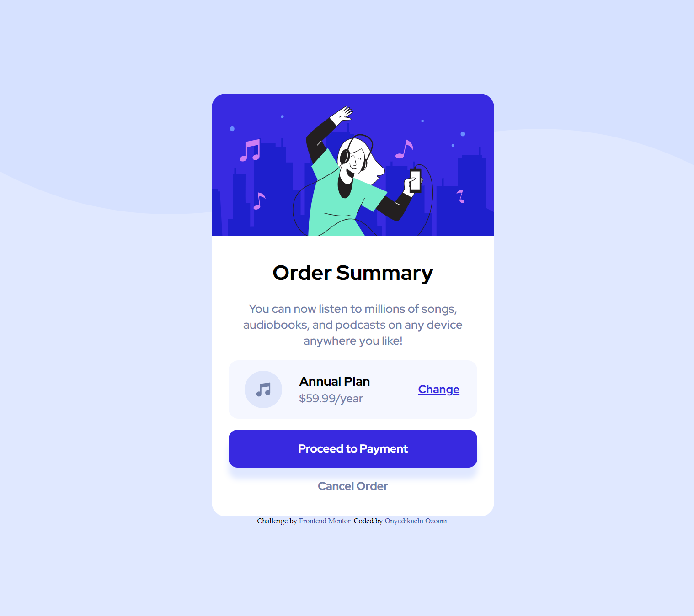

<!-- @format -->

# Frontend Mentor - Order summary card solution

This is a solution to the [Order summary card challenge on Frontend Mentor](https://www.frontendmentor.io/challenges/order-summary-component-QlPmajDUj). Frontend Mentor challenges help you improve your coding skills by building realistic projects.

## Table of contents

-   [Frontend Mentor - Order summary card solution](#frontend-mentor---order-summary-card-solution)
    -   [Table of contents](#table-of-contents)
    -   [Overview](#overview)
        -   [The challenge](#the-challenge)
        -   [Screenshot](#screenshot)
        -   [Links](#links)
    -   [My process](#my-process)
        -   [Built with](#built-with)
    -   [Author](#author)
    -   [Acknowledgments](#acknowledgments)

## Overview

### The challenge

Users should be able to:

-   See hover states for interactive elements

### Screenshot

-   Mobile design: 
-   Desktop design: 

### Links

-   Solution URL: [Solution posted on Frontend Mentor site](https://www.frontendmentor.io/solutions/done-with-flexbox-UFgyVSKiUK)
-   Live Site URL: [Checkout the live site](https://order-summary-component-nerdynerd.netlify.app/)

## My process

### Built with

-   Semantic HTML5 markup
-   CSS custom properties
-   Flexbox
-   Mobile-first workflow

## Author

-   My Frontend Mentor profile - [@OnyedikachiOzoani](https://www.frontendmentor.io/profile/OnyedikachiOzoani)
-   My GitHub profile - [@OnyedikachiOzoani](https://github.com/OnyedikachiOzoani)

## Acknowledgments

All thanks to Frontend Mentor for sharing this challenge and helping me practise my Frontend skills.

**Thanks for checking out my project**
